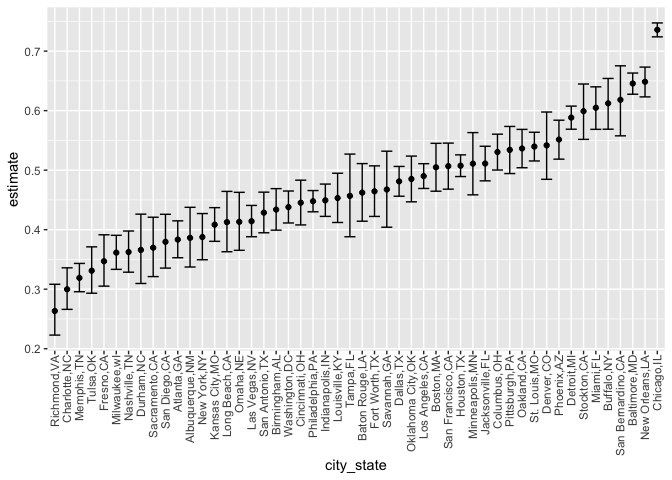

P8015_Hw5_agd2159
================
Zander De Jesus
11-15-2023

``` r
library(tidyverse)
library(rvest)
library(patchwork)
set.seed(1234)

theme_set(theme(legend.position = "bottom"))

options(
  ggplot2.continuous.colour = "viridis",
  ggplot2.continuous.fill = "viridis"
)

scale_colour_discrete = scale_colour_viridis_d
scale_fill_discrete = scale_fill_viridis_d
```

# Problem 1: Washington Post Homicide Data Exploration

``` r
wp_homicides = read_csv("homicide-data/homicide-data.csv", na = c("", "NA", "Unknown")) |> 
  mutate(city_state = str_c(city, state, sep = ","),
    resolution = case_when(
      disposition == "Closed without arrest" ~ "unsolved",
      disposition == "Open/No arrest"        ~ "unsolved",
      disposition == "Closed by arrest"      ~ "solved")) |> 
  filter(city_state != "Tulsa,AL")
```

    ## Rows: 52179 Columns: 12
    ## ── Column specification ────────────────────────────────────────────────────────
    ## Delimiter: ","
    ## chr (8): uid, victim_last, victim_first, victim_race, victim_sex, city, stat...
    ## dbl (4): reported_date, victim_age, lat, lon
    ## 
    ## ℹ Use `spec()` to retrieve the full column specification for this data.
    ## ℹ Specify the column types or set `show_col_types = FALSE` to quiet this message.

Before more transformative cleaning, this dataframe has 52178 entries,
on variables that include the victim name, race, age, and sex; the date
the homicide was reported; and the location of the homicide. Using the
mutate and case_when functions, we add a city_state variable that
combines the string data from both city and state, and a resolution
column variable that indicates the present status of a homicide case.
Filtering out Tulsa, AL which was accidentally included alongside Tulsa,
OK.

``` r
totals_homicide_df = 
  wp_homicides |> 
  select(city_state, disposition, resolution) |>  
  group_by(city_state) |> 
  summarize(
    homicides_total = n(),
    homicides_unsolved = sum(resolution == "unsolved"))
```

Starting to use `prop.test` to see the proportional significance of
unresolved homicides in particular cities.

``` r
bmore_test = 
  prop.test(
    x = filter(totals_homicide_df, city_state == "Baltimore,MD") |> pull(homicides_unsolved),
    n = filter(totals_homicide_df, city_state == "Baltimore,MD") |>  pull(homicides_total)) 

broom::tidy(bmore_test) |> 
  knitr::kable(digits = 3)
```

| estimate | statistic | p.value | parameter | conf.low | conf.high | method                                               | alternative |
|---------:|----------:|--------:|----------:|---------:|----------:|:-----------------------------------------------------|:------------|
|    0.646 |   239.011 |       0 |         1 |    0.628 |     0.663 | 1-sample proportions test with continuity correction | two.sided   |

Now that we have this function established, important to standardize
across cities. Map package can place this test across all cells within
the tibble.

``` r
test_results = 
  totals_homicide_df |> 
  mutate(
    prop_tests = map2(homicides_unsolved, homicides_total, \(x, y) prop.test(x = x, n = y)),
    tidy_tests = map(prop_tests, broom::tidy)) |>  
  select(-prop_tests) |> 
  unnest(tidy_tests) |> 
  select(city_state, estimate, conf.low, conf.high) |>  
  mutate(city_state = fct_reorder(city_state, estimate))
```

We then visualize the unsolved case proportion across cities using
ggplot scatterpoint tools.

``` r
test_results |>  
  mutate(city_state = fct_reorder(city_state, estimate)) |>  
  ggplot(aes(x = city_state, y = estimate)) + 
  geom_point() + 
  geom_errorbar(aes(ymin = conf.low, ymax = conf.high)) + 
  theme(axis.text.x = element_text(angle = 90, hjust = 1))
```

<!-- -->

The percentage of unsolved homicides ranges across cities from about 25%
on the low end to over 60%-70% on the highest end. **Chicago, IL, New
Orleans, LA, and Baltimore, MD** are the top three cities for the
highest proportion of unresolved homicides.

# Problem 2: Compiling Randomized Control Trial Dataframe using Iterative Functions (MAP)

The Randomized Control Trial Data is coming in 20 separated CSV files,
10 for the control group and 10 for the experimental. Each contains two
rows of data, the 8 weeks of data and the observational values recorded
weekly in the longtitudinal study.

Based on the setup of these datasets, as we import it will be important
to `pivot_longer` so that week number and value are made two
standardized columns rather than disaggregated rows across study
participants.

``` r
#Instructions Start with a dataframe containing all file names; the list.files function will help

study_participants = list.files(path = "./data", full.names = TRUE)

#Initial Import and Column Creation
longtitudinal_results = study_participants |> 
  map_dfr(read_csv, .id = "participant_id") |> 
  mutate(study_arm = print(dir(path = "./data", include.dirs = FALSE))) |> 
  mutate(study_arm = str_remove(study_arm, ".csv")) |> 
  separate(study_arm, into = c("study_arm", "subject_id")) |> 
  select(participant_id, study_arm, subject_id, everything())
```

    ## Rows: 1 Columns: 8
    ## ── Column specification ────────────────────────────────────────────────────────
    ## Delimiter: ","
    ## dbl (8): week_1, week_2, week_3, week_4, week_5, week_6, week_7, week_8
    ## 
    ## ℹ Use `spec()` to retrieve the full column specification for this data.
    ## ℹ Specify the column types or set `show_col_types = FALSE` to quiet this message.
    ## Rows: 1 Columns: 8
    ## ── Column specification ────────────────────────────────────────────────────────
    ## Delimiter: ","
    ## dbl (8): week_1, week_2, week_3, week_4, week_5, week_6, week_7, week_8
    ## 
    ## ℹ Use `spec()` to retrieve the full column specification for this data.
    ## ℹ Specify the column types or set `show_col_types = FALSE` to quiet this message.
    ## Rows: 1 Columns: 8
    ## ── Column specification ────────────────────────────────────────────────────────
    ## Delimiter: ","
    ## dbl (8): week_1, week_2, week_3, week_4, week_5, week_6, week_7, week_8
    ## 
    ## ℹ Use `spec()` to retrieve the full column specification for this data.
    ## ℹ Specify the column types or set `show_col_types = FALSE` to quiet this message.
    ## Rows: 1 Columns: 8
    ## ── Column specification ────────────────────────────────────────────────────────
    ## Delimiter: ","
    ## dbl (8): week_1, week_2, week_3, week_4, week_5, week_6, week_7, week_8
    ## 
    ## ℹ Use `spec()` to retrieve the full column specification for this data.
    ## ℹ Specify the column types or set `show_col_types = FALSE` to quiet this message.
    ## Rows: 1 Columns: 8
    ## ── Column specification ────────────────────────────────────────────────────────
    ## Delimiter: ","
    ## dbl (8): week_1, week_2, week_3, week_4, week_5, week_6, week_7, week_8
    ## 
    ## ℹ Use `spec()` to retrieve the full column specification for this data.
    ## ℹ Specify the column types or set `show_col_types = FALSE` to quiet this message.
    ## Rows: 1 Columns: 8
    ## ── Column specification ────────────────────────────────────────────────────────
    ## Delimiter: ","
    ## dbl (8): week_1, week_2, week_3, week_4, week_5, week_6, week_7, week_8
    ## 
    ## ℹ Use `spec()` to retrieve the full column specification for this data.
    ## ℹ Specify the column types or set `show_col_types = FALSE` to quiet this message.
    ## Rows: 1 Columns: 8
    ## ── Column specification ────────────────────────────────────────────────────────
    ## Delimiter: ","
    ## dbl (8): week_1, week_2, week_3, week_4, week_5, week_6, week_7, week_8
    ## 
    ## ℹ Use `spec()` to retrieve the full column specification for this data.
    ## ℹ Specify the column types or set `show_col_types = FALSE` to quiet this message.
    ## Rows: 1 Columns: 8
    ## ── Column specification ────────────────────────────────────────────────────────
    ## Delimiter: ","
    ## dbl (8): week_1, week_2, week_3, week_4, week_5, week_6, week_7, week_8
    ## 
    ## ℹ Use `spec()` to retrieve the full column specification for this data.
    ## ℹ Specify the column types or set `show_col_types = FALSE` to quiet this message.
    ## Rows: 1 Columns: 8
    ## ── Column specification ────────────────────────────────────────────────────────
    ## Delimiter: ","
    ## dbl (8): week_1, week_2, week_3, week_4, week_5, week_6, week_7, week_8
    ## 
    ## ℹ Use `spec()` to retrieve the full column specification for this data.
    ## ℹ Specify the column types or set `show_col_types = FALSE` to quiet this message.
    ## Rows: 1 Columns: 8
    ## ── Column specification ────────────────────────────────────────────────────────
    ## Delimiter: ","
    ## dbl (8): week_1, week_2, week_3, week_4, week_5, week_6, week_7, week_8
    ## 
    ## ℹ Use `spec()` to retrieve the full column specification for this data.
    ## ℹ Specify the column types or set `show_col_types = FALSE` to quiet this message.
    ## Rows: 1 Columns: 8
    ## ── Column specification ────────────────────────────────────────────────────────
    ## Delimiter: ","
    ## dbl (8): week_1, week_2, week_3, week_4, week_5, week_6, week_7, week_8
    ## 
    ## ℹ Use `spec()` to retrieve the full column specification for this data.
    ## ℹ Specify the column types or set `show_col_types = FALSE` to quiet this message.
    ## Rows: 1 Columns: 8
    ## ── Column specification ────────────────────────────────────────────────────────
    ## Delimiter: ","
    ## dbl (8): week_1, week_2, week_3, week_4, week_5, week_6, week_7, week_8
    ## 
    ## ℹ Use `spec()` to retrieve the full column specification for this data.
    ## ℹ Specify the column types or set `show_col_types = FALSE` to quiet this message.
    ## Rows: 1 Columns: 8
    ## ── Column specification ────────────────────────────────────────────────────────
    ## Delimiter: ","
    ## dbl (8): week_1, week_2, week_3, week_4, week_5, week_6, week_7, week_8
    ## 
    ## ℹ Use `spec()` to retrieve the full column specification for this data.
    ## ℹ Specify the column types or set `show_col_types = FALSE` to quiet this message.
    ## Rows: 1 Columns: 8
    ## ── Column specification ────────────────────────────────────────────────────────
    ## Delimiter: ","
    ## dbl (8): week_1, week_2, week_3, week_4, week_5, week_6, week_7, week_8
    ## 
    ## ℹ Use `spec()` to retrieve the full column specification for this data.
    ## ℹ Specify the column types or set `show_col_types = FALSE` to quiet this message.
    ## Rows: 1 Columns: 8
    ## ── Column specification ────────────────────────────────────────────────────────
    ## Delimiter: ","
    ## dbl (8): week_1, week_2, week_3, week_4, week_5, week_6, week_7, week_8
    ## 
    ## ℹ Use `spec()` to retrieve the full column specification for this data.
    ## ℹ Specify the column types or set `show_col_types = FALSE` to quiet this message.
    ## Rows: 1 Columns: 8
    ## ── Column specification ────────────────────────────────────────────────────────
    ## Delimiter: ","
    ## dbl (8): week_1, week_2, week_3, week_4, week_5, week_6, week_7, week_8
    ## 
    ## ℹ Use `spec()` to retrieve the full column specification for this data.
    ## ℹ Specify the column types or set `show_col_types = FALSE` to quiet this message.
    ## Rows: 1 Columns: 8
    ## ── Column specification ────────────────────────────────────────────────────────
    ## Delimiter: ","
    ## dbl (8): week_1, week_2, week_3, week_4, week_5, week_6, week_7, week_8
    ## 
    ## ℹ Use `spec()` to retrieve the full column specification for this data.
    ## ℹ Specify the column types or set `show_col_types = FALSE` to quiet this message.
    ## Rows: 1 Columns: 8
    ## ── Column specification ────────────────────────────────────────────────────────
    ## Delimiter: ","
    ## dbl (8): week_1, week_2, week_3, week_4, week_5, week_6, week_7, week_8
    ## 
    ## ℹ Use `spec()` to retrieve the full column specification for this data.
    ## ℹ Specify the column types or set `show_col_types = FALSE` to quiet this message.
    ## Rows: 1 Columns: 8
    ## ── Column specification ────────────────────────────────────────────────────────
    ## Delimiter: ","
    ## dbl (8): week_1, week_2, week_3, week_4, week_5, week_6, week_7, week_8
    ## 
    ## ℹ Use `spec()` to retrieve the full column specification for this data.
    ## ℹ Specify the column types or set `show_col_types = FALSE` to quiet this message.
    ## Rows: 1 Columns: 8
    ## ── Column specification ────────────────────────────────────────────────────────
    ## Delimiter: ","
    ## dbl (8): week_1, week_2, week_3, week_4, week_5, week_6, week_7, week_8
    ## 
    ## ℹ Use `spec()` to retrieve the full column specification for this data.
    ## ℹ Specify the column types or set `show_col_types = FALSE` to quiet this message.

    ##  [1] "con_01.csv" "con_02.csv" "con_03.csv" "con_04.csv" "con_05.csv"
    ##  [6] "con_06.csv" "con_07.csv" "con_08.csv" "con_09.csv" "con_10.csv"
    ## [11] "exp_01.csv" "exp_02.csv" "exp_03.csv" "exp_04.csv" "exp_05.csv"
    ## [16] "exp_06.csv" "exp_07.csv" "exp_08.csv" "exp_09.csv" "exp_10.csv"

``` r
longtitudinal_results |> 
  knitr::kable(digits = 2)
```

| participant_id | study_arm | subject_id | week_1 | week_2 | week_3 | week_4 | week_5 | week_6 | week_7 | week_8 |
|:---------------|:----------|:-----------|-------:|-------:|-------:|-------:|-------:|-------:|-------:|-------:|
| 1              | con       | 01         |   0.20 |  -1.31 |   0.66 |   1.96 |   0.23 |   1.09 |   0.05 |   1.94 |
| 2              | con       | 02         |   1.13 |  -0.88 |   1.07 |   0.17 |  -0.83 |  -0.31 |   1.58 |   0.44 |
| 3              | con       | 03         |   1.77 |   3.11 |   2.22 |   3.26 |   3.31 |   0.89 |   1.88 |   1.01 |
| 4              | con       | 04         |   1.04 |   3.66 |   1.22 |   2.33 |   1.47 |   2.70 |   1.87 |   1.66 |
| 5              | con       | 05         |   0.47 |  -0.58 |  -0.09 |  -1.37 |  -0.32 |  -2.17 |   0.45 |   0.48 |
| 6              | con       | 06         |   2.37 |   2.50 |   1.59 |  -0.16 |   2.08 |   3.07 |   0.78 |   2.35 |
| 7              | con       | 07         |   0.03 |   1.21 |   1.13 |   0.64 |   0.49 |  -0.12 |  -0.07 |   0.46 |
| 8              | con       | 08         |  -0.08 |   1.42 |   0.09 |   0.36 |   1.18 |  -1.16 |   0.33 |  -0.44 |
| 9              | con       | 09         |   0.08 |   1.24 |   1.44 |   0.41 |   0.95 |   2.75 |   0.30 |   0.03 |
| 10             | con       | 10         |   2.14 |   1.15 |   2.52 |   3.44 |   4.26 |   0.97 |   2.73 |  -0.53 |
| 11             | exp       | 01         |   3.05 |   3.67 |   4.84 |   5.80 |   6.33 |   5.46 |   6.38 |   5.91 |
| 12             | exp       | 02         |  -0.84 |   2.63 |   1.64 |   2.58 |   1.24 |   2.32 |   3.11 |   3.78 |
| 13             | exp       | 03         |   2.15 |   2.08 |   1.82 |   2.84 |   3.36 |   3.61 |   3.37 |   3.74 |
| 14             | exp       | 04         |  -0.62 |   2.54 |   3.78 |   2.73 |   4.49 |   5.82 |   6.00 |   6.49 |
| 15             | exp       | 05         |   0.70 |   3.33 |   5.34 |   5.57 |   6.90 |   6.66 |   6.24 |   6.95 |
| 16             | exp       | 06         |   3.73 |   4.08 |   5.40 |   6.41 |   4.87 |   6.09 |   7.66 |   5.83 |
| 17             | exp       | 07         |   1.18 |   2.35 |   1.23 |   1.17 |   2.02 |   1.61 |   3.13 |   4.88 |
| 18             | exp       | 08         |   1.37 |   1.43 |   1.84 |   3.60 |   3.80 |   4.72 |   4.68 |   5.70 |
| 19             | exp       | 09         |  -0.40 |   1.08 |   2.66 |   2.70 |   2.80 |   2.64 |   3.51 |   3.27 |
| 20             | exp       | 10         |   1.09 |   2.80 |   2.80 |   4.30 |   2.25 |   6.57 |   6.09 |   4.64 |

``` r
#Cleaning using pivot longer
longtitudinal_results = longtitudinal_results |> 
  pivot_longer(
    week_1:week_8,
    names_to = "study_week",
    values_to = "observations",
    names_prefix = "week_"
  ) |> 
  mutate(study_week = as.numeric(study_week))

longtitudinal_results |> 
  head()
```

    ## # A tibble: 6 × 5
    ##   participant_id study_arm subject_id study_week observations
    ##   <chr>          <chr>     <chr>           <dbl>        <dbl>
    ## 1 1              con       01                  1         0.2 
    ## 2 1              con       01                  2        -1.31
    ## 3 1              con       01                  3         0.66
    ## 4 1              con       01                  4         1.96
    ## 5 1              con       01                  5         0.23
    ## 6 1              con       01                  6         1.09

Now that weeks and observations are aggregated into two centralized
columns, there is greater ability to do grouped_by summary calculations.

We are asked to next visualize these observations in spaghetti plots,
separating by control or experimental arm, (faceting):

``` r
#Instructions: Make a spaghetti plot showing observations on each subject over time, and comment on differences between groups

ggp_results = longtitudinal_results |>
  group_by(subject_id) |> 
  ggplot(aes(x = study_week, y = observations)) + 
           geom_point(alpha = 0.7 , aes(color = subject_id)) +  geom_line(alpha = 0.7, aes(color = subject_id)) +
          geom_smooth() +
  labs(
    title = "Randomized Control Trial Results Over 8 Weeks, Control vs. Experimental Arms",
    x = "Week of Study",
    y = "Observational Value"
  ) +
  facet_grid(. ~ study_arm)

ggp_results
```

    ## `geom_smooth()` using method = 'loess' and formula = 'y ~ x'

<!-- -->

**Visualization Interpretation:**

This spaghetti plot highlights the observed changes in values across all
8 weeks of the RCT, grouped by the 10 subjects in both the control and
experimental study arms. This visualization shows us that for the
experimental group, there was a higher range of observed values and an
average increase in observed values across experimental subjects, as
illustated by the trendline produced by `geom_smooth()`. The average
trendline started around an observed value of approximately 1.5 at week
1 and an average value of over 5 by week 8, showing a trajectory of net
increase each weekly interval.

The control group had values that were more consistently within a narrow
range, and the average trendline produced by this control group had
values slightly above 1 across this 8 week study period. The control
group had some members also dip below 0 into negative observed value
over multiple weeks, which did not occur for any in the experimental
group.

# Problem 3: Simulation of One-Sample T-Test

We start with the task of setting a normally distributed model that will
be iterated, of size n = 30, standard dev sigma of 5, and mean of 0.

For this problem, the seed was set at the start of the document global
settings as `set.seed(1234)`.

``` r
sim_rnorm_data = function(n, mu, sigma = 5) {
    x = rnorm(n = n, mean = mu, sd = sigma)
}

sim_t_test = function(x) {
  t.test(x = x, mu = 0, conf.level = 0.95) |> 
    broom::tidy()
}
```

I will attempt to create an iterated data frame given the model design
specifications using the `expand_grid` function and `map`. Using
template from class `simulations.rmd` worksheet.

``` r
#sample size n of 30
#true means across 0 to 6
#originally had sample_size and true_mu variables but changed back to n and mu for consistency with sim_rnorm_data function. Did not want to confuse variables.

sim_results_df = 
  expand_grid(
    n = 30,
    mu = 0:6,
    iter = 1:5000
  ) |> 
  mutate(
    data_df = map2(n, mu, sim_rnorm_data)) |> 
  mutate(t_test_results = map(data_df, sim_t_test)) |> 
  unnest(t_test_results)
  
sim_results_df
```

    ## # A tibble: 35,000 × 12
    ##        n    mu  iter data_df    estimate statistic p.value parameter conf.low
    ##    <dbl> <int> <int> <list>        <dbl>     <dbl>   <dbl>     <dbl>    <dbl>
    ##  1    30     0     1 <dbl [30]>   -1.48     -1.80  0.0826         29   -3.17 
    ##  2    30     0     2 <dbl [30]>   -2.76     -3.15  0.00376        29   -4.55 
    ##  3    30     0     3 <dbl [30]>    0.693     0.775 0.445          29   -1.14 
    ##  4    30     0     4 <dbl [30]>    0.558     0.756 0.456          29   -0.951
    ##  5    30     0     5 <dbl [30]>    0.543     0.600 0.553          29   -1.31 
    ##  6    30     0     6 <dbl [30]>    0.632     0.646 0.523          29   -1.37 
    ##  7    30     0     7 <dbl [30]>    0.724     0.654 0.518          29   -1.54 
    ##  8    30     0     8 <dbl [30]>    0.361     0.349 0.729          29   -1.75 
    ##  9    30     0     9 <dbl [30]>    0.615     0.849 0.403          29   -0.867
    ## 10    30     0    10 <dbl [30]>    0.765     0.837 0.410          29   -1.10 
    ## # ℹ 34,990 more rows
    ## # ℹ 3 more variables: conf.high <dbl>, method <chr>, alternative <chr>

After allowing for 5,000 iterations across 7 different assigned true
means (mu = 0 through 6), the simulation dataframe `sim_results_df`
holds **35000** observations across **12** column variables. The mean
mu, p value, and estimate values are of primary interest for the
upcoming visualizations.

\###Visualization 1: *Instructions: Make a plot showing the proportion
of times the null was rejected (the power of the test) on the y axis and
the true value of mu on the x axis. Describe the association between
effect size and power.*

``` r
power_plot = sim_results_df |> 
  group_by(mu) |> 
  mutate(test_status = case_when(
    p.value >= 0.05 ~ "Null Accepted",
    p.value < 0.05 ~ "Null Rejected"
  )) |> 
  count(test_status)

power_plot |> 
  knitr::kable(digits = 2)
```

|  mu | test_status   |    n |
|----:|:--------------|-----:|
|   0 | Null Accepted | 4755 |
|   0 | Null Rejected |  245 |
|   1 | Null Accepted | 4065 |
|   1 | Null Rejected |  935 |
|   2 | Null Accepted | 2213 |
|   2 | Null Rejected | 2787 |
|   3 | Null Accepted |  568 |
|   3 | Null Rejected | 4432 |
|   4 | Null Accepted |   45 |
|   4 | Null Rejected | 4955 |
|   5 | Null Accepted |    3 |
|   5 | Null Rejected | 4997 |
|   6 | Null Rejected | 5000 |

This cleaned data table retrieves the count n of p-values below 0.05
which reject the null and p-values above 0.05 which accept the null
hypothesis. Proportions can then be calculated from the following count
values.

``` r
power_plot = power_plot |> 
  filter(test_status == "Null Rejected") |> 
  mutate(power = n / 5000)

power_plot |> 
  group_by(mu) |> 
  ggplot(aes(x = mu, y = power, fill = mu)) +
  geom_col() + 
  labs(
    title = "Identifying Hypothesis Testing Power of One-Sample T-Test, 5000 Iterations",
    x = "Assigned True Mean Mu",
    y = "Statistical Testing Power (percentage of p-value <0.05)"
  ) + 
  scale_x_continuous(breaks = scales::pretty_breaks(6))
```

<!-- -->

This visualization identifies the percentage of p-values within the
simulated 5000 t-tests that were statistically significant and rejected
the null hypothesis, for the 7 different assigned true means 0 through
6. Considering in the function `sim_t_test` we were asked to test from a
base mean of 0 and alpha of 0.05, the true assigned mean of 0 in the
simulation dataframe had the closest results, with statistical power of
**0.052** after 5,000 iterations. As the true assigned mean moved higher
away from the base mean of 0, the larger amount of p-values rejected the
null hypothesis of presumed randomness, and staitiscal power grows. By
true assigned mean of 4 - 6, the statistical power is virtually 98 -
100%, due to having the greatest deviations from the mean across the
modeled dataframes.
